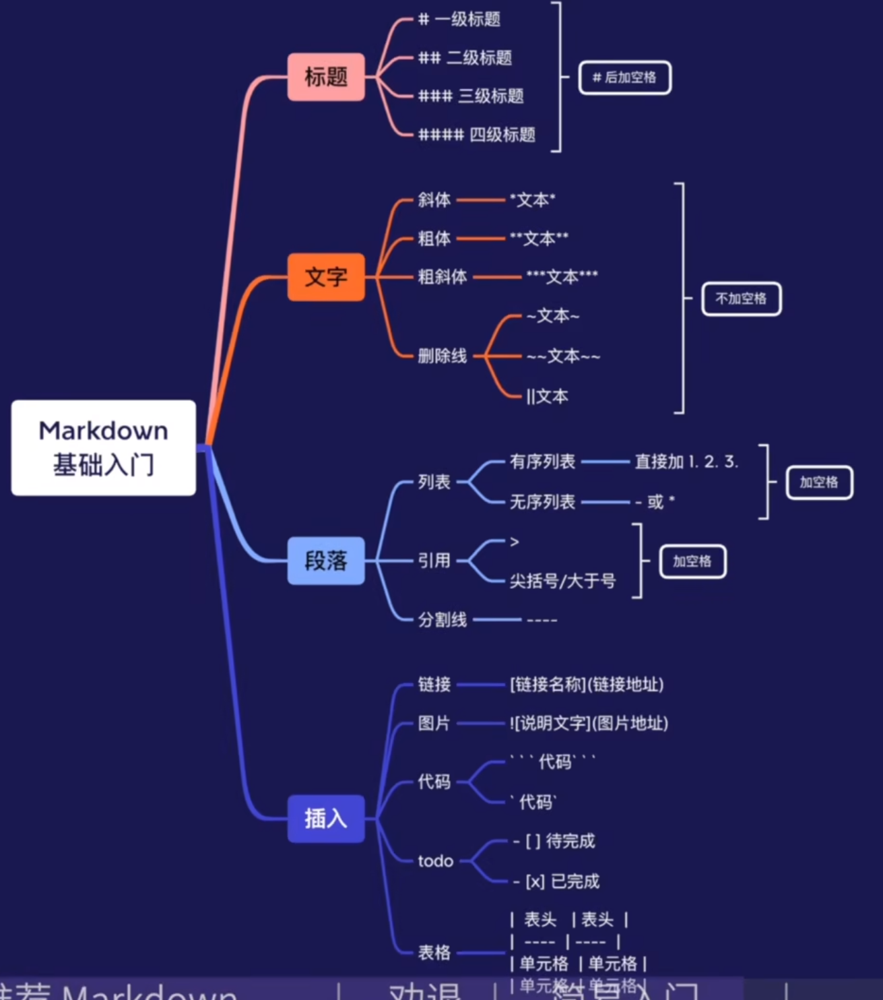

1. >  砌墙， 生成一面垂直面的墙

   

2. 有序列表直接输入数字

3. - 生成无序列表

4. - [x] 方括号- 生成可勾选的任务完成方块

5. 

[md语句网页](https://www.bilibili.com/video/BV1JA411h7Gw/?spm_id_from=333.337.search-card.all.click&vd_source=c0725c5cec93fb4b8f40b1ca1664d64c "原网页")

