# 5.15- 5.16 word 105 页重温

数据流图博客

https://blog.csdn.net/qq_52108058/article/details/130657109

# 5.17  

# 计算机组成与结构

## 流水线最大吞吐率

> 最大吞吐率为： 流水线任务时长最长的时间 的 倒数， 如题为3Δt
>
> 加速比：  不使用流水线 /  使用流水线

流水线**时长** = 第一条运行的时间 + 最长 × （指令数-1）

## 主存地址定位到Cache的方式

 				为解决高速CPU与低速内存之间的速度差异，最经济、有效的方法是在两者之间插入容量不大但操作速度很高的存储器髙速缓存（Cache），起到缓冲作用

使CPU既可以以较快速度存取Cache中的数据，又不使系统成本过高。

 与主存相比，Cache的容量很小，它保存的只是一部分主存内容的一个副本，且Cache与主存的数据交换是以块为单位。 地址映射即是应用某种方法把主存地址定位到Cache中，有全相联方式、直接方式和组相联方式三种方式。 

1.全相联映射方式。 这是一种最简单而又直接的映射方法，指主存中每个块只能映射到Cache的一个特定的块。在该方法中，Cache块地址j和主存块地址i的关系为： j=i mod Cb 其中Cb是Cache的块数。这样，整个Cache地址与主存地址的低位部分完全相同。

直接映射法的优点是所需硬件简单，只需要容量较小的按地址访问的区号标志表存储器和少量比较电路；缺点是Cache块冲突概率较高，只要有两个或两个以上经常使用的块恰好被映射到Cache中的同一个块位置时，就会使Cache命中率急剧下降。

 2.直接映射方式。 这种映射方式允许主存的每一块信息可以存到Cache的任何一个块空间，也允许从已被占满的Cache中替换掉任何一块信息。全相联映射的优点是块冲突概率低：其缺点是访问速度慢，并且成本太高。

 3.组相联映射方式。 这种方式是前两种方式的折衷方案。这种映射方式在组间是直接映射，而组内是全相联映射，其性能和复杂性介于直接映射和全相联映射之间。

 CPU在访问内存时，首先判断所要访问的内容是否在Cache中，如果在，就称为“命中”，此时CPU直接从Cache中调用该内容；否则，就称为“不命中”。一般来说，Cache的存储容量比主存的容量小得多，但不能太小，太小会使命中率太低；也没有必要过大，过大不仅会增加成本，而且当容量超过一定值后，命中率随容量的增加将不会有明显地增长。             

 				RISC和CISC是目前设计制造微处理器的两种典型技术，虽然它们都试图在体系结构、操作运行、软件硬件、编译时间和运行时间等诸多因素中做出某种平衡，以求达到高效的目的，但采用的方法不同，主要区别有：

 ①指令系统：RISC设计者把主要精力放在那些经常使用的指令上，尽量使它们具有简单高效的特色。对不常用的功能，常通过组合指令来完成。因此，在RISC机器上实现特殊功能时，效率可能较低。但可以利用流水技术和超标量技术加以改进和弥补。 而CISC计算机的指令系统比较丰富，有专用指令来完成特定的功能。因此，处理特殊任务效率较高。 

②存储器操作：RISC对存储器操作有限制，使控制简单化；而CISC机器的存储器操作指令多，操作直接。 

③程序：RISC汇编语言程序一般需要较大的内存空间，实现特殊功能时程序复杂， 不易设计；而CISC汇编语言程序编程相对简单，科学计算及复杂操作的程序设计相对容易，效率较高。

 ④中断：RISC机器在一条指令执行的适当地方可以响应中断；而CISC机器是在一条指令执行结束后响应中断。 

⑤CPU: RISC的CPU包含有较少的单元电路，因而面积小、功耗低；而CISC CPU包含有丰富的电路单元，因而功能强、面积大、功耗大。

 ⑥设计周期：RISC微处理器结构简单，布局紧凑，设计周期短，且易于采用最新技术；CISC微处理器结构复杂，设计周期长 

⑦用户使用：RISC微处理器结构简单，指令规整，性能容易把握，易学易用；CISC微处理器结构复杂，功能强大，实现特殊功能容易。

 ⑧应用范围：由于RISC指令系统的确定与特定的应用领域有关，故RISC机器更 适合于专用机；而CISC机器则更适合于通用机。   

 

## 输入输出控制方式

 				在计算机中，输入输出控制方式主要有5种，分别是程序查询方式(程序控制方式)、程序中断方式、DMA工作方式、通道方式、I/O处理机。这5种方式占用主机CPU时间按多到少排序为:程序查询方式(程序控制方式)、程序中断方式、DMA工作方式、通道方式、I/O处理机。             

## 浮点表示法

 				在浮点表示方式下，浮点数的精度由尾数部分来确定，范围则取决于阶码的长度，因此阶码e越大，所表示的浮点数值范围越大，尾数的位数m越大，所表示的浮点数精度越高。          

### 不懂

   

#  5.18

# 操作系统选择题

 				

## 管道通信

 		管道通信是一种共享文件模式，它基于文件系统，连接于两个通信进程之间，以先进先出的方式实现消息的单向传送。管道是一个特殊文件，在内核中通过文件描述符表示。一个管道总是连接两个命令，将左边命令的标准输出与右边命令的标准输入相连，于是左边命令的输出结果就直接成了右边命令的输入

## 段表判断是否越界

 逻辑地址： （0，128）表示 在基地址的基础上加上偏移量，判断是否大于段长

​	段号0， 基地址为1598，段长600

- 段的起始地址：1598
- 段的结束地址：1598 + 600 - 1 = 2197

（0，128）， 只需判断128 是否小于段长，是的话不越界，能找到

## 磁盘数据块索引

逻辑块号： 直接索引 为 1对1

索引的块号个数为： 1KB / 4B = 256 

一级地址直接索引 

-   arr[5] = 5~ 260

-  arr[6] =  261 ~ 516 

所以 518在二级间接地址索引

一级可索引的块大小为： 512  * 1K  *2个 = 1024K

## 微内核结构的操作系统设计功能图

## 磁盘调度  移臂调度与旋转调度

   解题思路， 与22比较，后与前者比较， 距离最短依次排序， 22 - 25 - 18-40-45

​		然后同柱，先扇区后磁头号，即可得出答案

## 链式存储找磁盘块

位示图大小与物理块的关系

# 改变策略  - 直接刷真题

## 2022下半年真题

## 选择题

2- cpu 主要由运算器、 控制器、 寄存器组和**内部总线**（数据总线DBUS、 地址总线 ABUS ）等部件组成

- Dram 动态随机存储器， 需要不断**刷新**电路，否则数据消失

- 浮点数的**阶码决定范围，尾数决定精度**

- x.509 密码算法为： rsa , sm2算法为 ecc
-  软件著作权的翻译权： 将原软件由一种**自然语言文字**转换成另一种自然语言文字
- 原型开发适用于**需求不明确**的系统，整个过程在探索，开发成本高
- c/s三层结构描述中：应用的各层可以**并行开发，不一定**需要相同的开发语言
  - MVC 结构，前端用HTML语言，控制层和模型层用Java语言

- 多个模块**共享**同一个公共的数据环境，同享多个变量则是公共耦合
- 语句覆盖是**最弱**的路径覆盖，包含的情况少，**发现错误的能力弱**
- 软件文档使用者不同分成不同类型，所以有不同标准和要素
- 组件=模块，**单个模块**测试我们使用单元测试
- 对**数据**进行增删查改为数据维护
- 修改某个类的原因只有一个，即一个类只做一种类型的功能，该原则叫做**单一责任**
- 构件图表示系统部署，实现时各个构建之间的关系，为**系统的静态实现图**
- t38使多个前后连接的对象都有机会请求为： **责任链模式**，属于**行为型对象**模式，该模式适用于可处理一个请求的对象集合应被动态指定
  - 
- 客户端接口统一的驱动方法，适合采用： **适配器模式**
-  python中处理异常使用： **try except..**
- PYTHON3中，list(range(11) [10:0:-2]) : range（11）产生0-10，11个数字，后者表示从下标为10遍历到下标为0的后一个元素数据， **前闭后开[ 10:0）** [10,8,6,4,2]
- - x=input(),从键盘输入123， 打印的为**字符串**‘123’

- **多对多**的两个实体构造的中间表关键字由两张表的关键字组合而成
- 事务程序中发生的错误，叫做**事务**故障
- 采用邻接矩阵存储点与点的关系，有N个点，就有N*N元素，有e条边，有e个元素为1
- m阶B-树的说法中，错误的为： 叶子结点通过指针链接为有序表， 叶子结点本身依关键字的大小自小而大顺序链接
- 归并排序需要n 空间， 快速排序需要**lgn**个空间， 堆排序需要**1**个空间，冒泡排序需要**1**个空间， 所以**归并排序占用辅助存储空间最多
- 
-  p52 折半查找是典型的分治法
- Dijkstra 最短路径为**贪心思想**实现， 最短路径依图直接得出
- VLAN **tag 技术用于交换机**， 属于OSI 参考模型的 **数据链路层**
- Telnet协议是一种 基于 TCP的 远程登录协议， 对于通信质量要求较高使用TCP，确保高质量的通讯
- HTTP和HTTPS
- - https 协议使用加密传输，默认服务端口号为443
  - http 协议默认服务端口号为80
  - https的s表示**safe**安全， 电子支付类的网站使用**https 安全性高**

- 将网址转化为IP地址要用 **域名解析** 协议 （把文本标识的网址转化为数字标识网址）
  -  IP地址由服务器分配， 不具备唯一性， mac地址具唯一性，每一个硬件的身份证

1. ip地址长度为32 / 48为**，mac地址为48位**
2. ip地址工作网络层， mac地址工作在数据链路层
3. ip地址的分配是基于**网络拓补**（服务器分配，网络拓展）， mac地址基于制造商

- c59 英语选项： 
  1. style 结构、风格 
  2. functions 功能
  3. regarded视为
  4. statelessness无状态 

### 第24题前驱图 快速解法

如图，信号量 = 边数， 信号量的顺序，按照箭头指向后p数字组合的大小进行排序，如p1-p2 = 12 为最小， p5-p5 = 56最大为 s8

- p执行前为 p ，执行后为 v
- 如图 p3 执行前为： P (s2) P(s3),  中执行后为 V s(5)

### 44-46 责任链

- 责任链模式： 可处理一个请求的对象应被动态指定
- 过滤器模式： 不同的标准过滤一组对象，并通过逻辑操作以解耦的方式将它们进行链接起来
- 备忘录模式： 必须保存一个对象在某一时刻的状态，需要它时才能恢复到先前的状态
- 策略模式: 一个类定义了多种行为，并且以多个条件语句的形式出现

### 52- 53  主键及函数依赖集

 主键： 可以为**复合主键**，前提是多个子主键都无法独立推出所有属性

插入异常： 本该插入的数据，插入失败

删除异常：不应该删除的数据被删除

**存在冗余**， 在本题中， 为岗位和薪水可提取出来放在一张表，只写一行即可，如 岗位： 教师， 薪水1w， 就不用在原先表中重复输出数据

**插入异常**： 为插入一个新岗位： 讲师，由于主键为空（暂时没有教师）故插入失败

**删除异常**：删除了一行 岗位只有一个在职的讲师信息， 将讲师这项本应该存在的岗位删除

**解决措施**： 同存在冗余， 只需岗位薪水表中添加新职位， 即使原先数据删除也无影响

**传递依赖**：通过教师号 -》 岗位号-》 薪水，能通过属性（非主键属性）间接获取另外一个属性， 故存在传递依赖， 传递依赖不为第三范式，最高可达第二范式

**部分传递依赖**：不达第二范式， 最高可达第一范式

### 54-55 关系代数式

- 第一小题，
- 需先观察005为哪张表所特有的属性，员工号对应的为E表， 且员工号为第一列故选B

- 第二小题， 虎头山隧道为工程名在p表中， 自然联结需要有共同属性， EP 连接 P表仅1-工程号满足，故选D

Π 1, 2 表示只保留 1 和 2 列

在此题中： 

将E表（保留1 2 3列 ）与 （  **工程关系表**(只保留 1-2 列 ) 同 参与关系表 联接 -> 合并表 ） 进行联结

**链接的相同属性需要在后张表去除**

​	Π123 E表 保留前三列的E表  = E（员工号， 员工名， 部门名）

p 🔗EP （工程号， 工程名， 员工号， 工作量） 

再将上者两张表🔗： （员工号， 员工名，部门名， 工程号，工程名，工作量）

Π 2356  = （员工名， 部门名， 工程名， 工作量）

[此题连接](https://www.bilibili.com/video/BV1Fv4y1S7rU?p=45&spm_id_from=pageDriver&vd_source=c0725c5cec93fb4b8f40b1ca1664d64c)

### 60  m阶B-树的说法

### 62-63 分治算法 （未看）

[此题链接](https://www.bilibili.com/video/BV1Fv4y1S7rU?p=52&spm_id_from=pageDriver&vd_source=c0725c5cec93fb4b8f40b1ca1664d64c)

  

二叉树排序树表示， 再加上层数

​	有多少个叶子节点进行 **相加**

## 下午题  (5.20)

数据流图：

通过拿顶层数据图与0层数据图**进行比对**： 找到确实的数据流

0层数据流图 缺失的数据流：

1、 与顶层比对信息一 一比对， 再将缺失的信息进行比对

2、  一个实体应该有出 入 ，入 -> 某个实体 ->  出， 如果发现某段缺失，则该位置缺少数据流方向，再通过原文将缺失的数据流图补充

 

**数据流的意义**： 即通过比对原本直接抄写 即可

**表格**：为进行操作的信息 + 表字   如：计量检测信息 则为从 **计量检测信息表** 获取 

## 第二道－　ER图

实体间的联系：　１对１　，　１对多，　多对多

​	**在逻辑结构中：**

- １对多的情况下，　需要将１的主键写入多中，　作为其外键（联系）
- １对１的情况下：　将一方的主键写入任意一方的属性中
- 多对多不写入，使用一个关联表（重新建立一张表）来表示该关系。在关联表中，通常会包含两个实体的主键作为外键，以建立实体之间的关系

主键：通过该键可获取该实体其它属性的信息

外键：通过该键可与另外一个实体建立联系，　是另外一个实体的主键

## uml图

**uml 包含** （表示执行某个步骤，先执行箭头指向 ）
**泛化**（箭头指向为父类 <- 子类， 父类泛化子类， 一般到特殊，抽象具体化）
**组合 菱形 实心** （关闭此类， 其它相关类随之关闭）
**聚合 虚** （关闭此类， 其它相关类部分随之关闭）

子类顺序可**互换**

### 策略模式

## 设计模型

>A. 创建型类：创建型类是指设计模式中的一类模式，关注如何创建对象的实例。这些模式将对象的创建过程封装在类中，以提供更高的灵活性和可扩展性。设计模式包括工厂模式、抽象工厂模式、建造者模式、原型模式和单例模式。
>
>对应设计模式：
>
>- 工厂模式（Factory Pattern）
>- 抽象工厂模式（Abstract Factory Pattern）
>- 建造者模式（Builder Pattern）
>- 原型模式（Prototype Pattern）
>- 单例模式（Singleton Pattern）
>
>B. 创建型对象：创建型对象是指在设计模式中，通过某种机制创建对象的模式。它们关注对象的创建方式和时机，以提供更灵活和可复用的对象创建方式。设计模式包括简单工厂模式、工厂方法模式和抽象工厂模式。
>
>对应设计模式：
>
>- 简单工厂模式（Simple Factory Pattern）
>- 工厂方法模式（Factory Method Pattern）
>- 抽象工厂模式（Abstract Factory Pattern）
>
>C. 行为型对象：行为型对象是指在设计模式中，关注对象之间的交互和行为的模式。它们用于描述对象之间的通信方式、算法的组织和实现，以实现更灵活和可扩展的系统行为。设计模式包括策略模式、观察者模式和中介者模式等。
>
>对应设计模式：
>
>- 策略模式（Strategy Pattern）
>- 观察者模式（Observer Pattern）
>- 中介者模式（Mediator Pattern）
>
>D. 行为型类：行为型类是指在设计模式中，关注类之间的交互和行为的模式。它们描述了类之间的关系和协作方式，以实现更灵活和可扩展的系统行为。设计模式包括模板方法模式、解释器模式和访问者模式等。
>
>对应设计模式：
>
>- 模板方法模式（Template Method Pattern）
>- 解释器模式（Interpreter Pattern）
>- 访问者模式（Visitor Pattern）
>
>

### 类图23种设计模式

该题： 策略模式， 策略模式将一系列的算法封装起来，并使得它们可以互相相互替换，适用于使用一个算法的不同变体的场景

>在设计模式中，类图通常用于表示各种设计模式的结构和关系。以下是23种常见的设计模式以及它们的适用场景：
>
>1. 工厂方法模式：适用于需要创建**多个具有共同接口**的对象的场景。
>2. 抽象工厂模式：适用于需要创建一组相关或相互依赖的对象的场景。
>3. 单例模式：适用于需要保证系统中只存在一个实例的场景。
>4. 建造者模式：适用于创建复杂对象的场景，通过分步骤的方式构建对象。
>5. 原型模式：适用于通过复制现有对象来创建新对象的场景。
>6. 适配器模式：适用于将一个类的接口转换成客户端所期望的另一个接口的场景。
>7. 桥接模式：适用于将抽象和实现分离，使它们可以独立变化的场景。
>8. 组合模式：适用于将对象组合成树形结构以表示"部分-整体"的层次结构的场景。
>9. 装饰器模式：适用于在不修改现有对象结构的情况下，动态地添加额外的行为或责任的场景。
>10. 外观模式：适用于提供一个统一的接口，以简化一组复杂子系统的使用的场景。
>11. 享元模式：适用于通过共享来有效地支持大量细粒度对象的场景。
>12. 代理模式：适用于为其他对象提供一种代理以控制对这个对象的访问的场景。
>13. 模板方法模式：适用于定义算法的框架，将一些步骤的具体实现延迟到子类的场景。
>14. 策略模式：适用于需要在运行时**根据不同情况选择不同算法**的场景。
>15. 观察者模式：适用于对象间存在一对多依赖关系，当一个对象状态改变时，其相关对象会被通知更新的场景。
>16. 迭代器模式：适用于顺序访问一个聚合对象中的元素的场景，而又不暴露其内部表示的场景。
>17. 职责链模式：适用于将请求的发送者和接收者解耦，以支持请求的传递、处理和避免耦合的场景。
>18. 命令模式：适用于将请求封装成对象，以支持请求的参数化、队列化和操作的撤销的场景。
>19. 备忘录模式：适用于在不违反封装原则的前提下，捕获和恢复对象的内部状态的场景。
>20. 状态模式：适用于对象的行为依赖于其内部状态，并且需要在运行时根据状态变化而改变行为的场景。
>21. 访问者模式：适用于在不修改被访问对象的前提下，定义对对象结构中元素的新操作的场景。
>22. 解释器模式：适用于定义一种语言的文法，并且通过解释器解释句子的场景。
>23. 中介者模式：适用于通过中介者对象来封装一组对象之间的交互，使其松散耦合的场景。
>
>每种设计模式都有其特定的应用场景和解决问题的方式，根据实际需求和设计目标选择适合的设计模式可以提高系统的灵活性、可维护性和可扩展性。
>
>

## 软考第四道题（c代码块， 排序）

思路： 原理+ 上下文理解， 一些判断条件，可先省略，直接到内部执行语句

​				试数

**算法时间复杂度？** ： 此部分要记： 堆排序： O(nlogn) 

## 软考第五题 

### 模式题

生成类，实现接口， 类**不可被直接**生成

要new的对象 要为 具体实现接口类 比如： Patience  patienct = new ConcretePatientct("zst");

生成的类是否要加字符串，要看其构造方法是否有使用参数

接口内需要补充方法时，在实现该接口类找寻， 通常直接将语句抄入即可

# 2022上半年真题

## 选择题

- 冯诺依曼计算机

  1. 冯诺依曼结构中，程序指令和数据存在同一个存储器中
  2. 程序的执行工作由指令进行自动控制
  3. 程序的功能都由中央处理器(CPU)
  4. 程序指令和数据都采用二进制表示

- DRAM集成率相对较低，功耗相对较大，需要动态刷新。

  SRAM集成率相对较高，功耗相对较小，不需要动态刷新。

- 中断过程中，程序现场信息保存在堆栈部分

- RISC和CICS的叙述

  1. RISC的指令种类和寻指方式相对于CICS更少
  2. RISC的大多指令在一个时钟周期内完成
  3. RISC采用硬布线逻辑控制，CISC采用微程序控制
  4. RISC与CISC都可以采用流水线技术，CISC更适合

- CPU与I/O接口交换信息是**异步传输**的

- 文件安全传输的是:   安全文件传送协议，英文：**Secure FTP**或字母缩写：SFTP）是一数据流连接，提供文件访问、传输和管理功能的网络传输协议。

- DDoS **(非病毒)** 指的是**分布式拒绝服务攻击**，不属于计算机病毒与木马

  - 永恒之蓝  蠕虫 特洛伊木马  计算机病毒与木马

- 杀毒软件只能防病毒，不能有效防止网站信息被篡改

- 通过在出口防火墙上配置**（ ACL）功能**可以**阻止外部未授权用户**访问内部网络。

  - ACL表示"Access Control List"，即访问控制列表
  - 访问控制列表（ACL）是一种基于包过滤的访问控制技术，它可以根据设定的条件对接口上的数据包进行过滤，允许其通过或丢弃。

- 能够有效防御SQL注入的手段是： 

  - 定期扫描系统漏洞并及时修复
  - 部署入侵检测系统阻断攻击
  - 对用户输入做关键字过滤

- 不能够有效防御的为： 部署Web应用防火墙进行防护

- 特殊的保护期限中，**商标权可以续注延长**

- 黑盒测试和百合测试常见方法

  - 黑盒测试方法包括	因果图、有效等价类和边界值分析等。
    - 白盒测试包括	语句覆盖、判断覆盖、条件覆盖、路径覆盖等

- 判断覆盖和路径覆盖都需要了解模块内部执行过程

  - 因果图鱼骨图（又名因果图、石川图），指的是一种发现问题“根本原因”的分析方法，常用在项目管理中，黑盒测试也可以使用该方法。

- 程序**运行**时将函数与响应调用所需要的代码绑定的为 **动态**绑定， **编译时为静态绑定**

- 针对月收入小于等于3500元免征个人所得税的需求，现分别输入3499，3500和3501进行测试**（边缘值分析）**

- 进行面向对象系统设计时，在包的依赖关系图中不允许存在环，这属于（ 无环依赖 ）原则。

  - 里氏替换原则：子类可以替换父类。
  - 依赖倒置原则：要依赖于抽象，而不是具体实现；针对接口编程，不要针对实现编程。
  - 无环依赖原则：在包的依赖关系图中不允许存在环，即包之间的结构必须是一个直接的无环图形
  - 单一职责原则：设计目的单一的类

- 面向对象分析的活动有：认定对象（名词）、组织对象（抽象成类）、对象间的相互作用、基于对象的操作

  - 面向对象实现需要选择一种面向对象程序**设计**语言

- Python, X=[1,2]表示List结构，*2表示重复2次，运算结果为[1,2,1,2]。

- Python数据类型相关内容。

  不可变数据（3 个）：Number（数字）、String（字符串）、Tuple（元组）。

  可变数据（3 个）：List（列表）、Dictionary（字典）、Set（集合）

- tuple(元组)类似于list列表，元组用 ( ) 标识。内部元素用逗号隔开。但是元组不能二次赋值，相当于只读列表。

- 在Python语言中，list（列表）是一种可变的、有序的序列结构，其中元素可以重复。

- 在Python语言中，（ tuple(元组)  ）是一种不可变的、有序的序列结构，其中元素可以重复
- 二分查找是将序列均分，每一次都是平均分配后左右序列数相同，相当于一棵二叉树，左右结点都是相同个数，最终形成的是平衡二叉树的形态
- 散列表（哈希表)，及其查找特点的叙述中，正确的是  (用线性探测法解决冲突容易产生聚集问题)
- 待排序列排序后，能确保排序码中的相对位置保持不变指的是稳定性排序，本题中只有冒泡排序是稳定的排序，快速排序、堆排序、简单选择排序都是不稳定排序
- 邻接表中，奇数个表示边的 表结点说明在图中有奇数条边，无法说明顶点个数是奇数还是偶数 (有向图)
  - 无向图的边一定是对称存在的，所以边的个数一定是偶数
- 在OSI参考模型中，（传输层 ）在物理线路上提供可靠的数据传输
- 在TCP/IP协议栈中，远程登录采用的协议为（TELNET ）。
  - HTTP是超文本传输协议，SMTP是邮件传输协议，FTP是文件传输协议
- SMTP是邮件传送协议，POP3是邮件收取协议，IMAP是交互邮件访问协议（访问邮件服务器，下载文件）

## 6. 同步传输 和 异步传输

>## 
>
>1. 异步传输：在异步传输中，每个数据字符都有自己的起始位和停止位，并且数据字符之间没有固定的时钟信号来同步传输。发送方和接收方之间的时钟可能存在一定的差异。异步传输适用于短距离、低速度的通信，如串口通信。它的主要特点是灵活性高，但传输效率相对较低。
>2. 同步传输：在同步传输中，数据传输使用一个共享的时钟信号来同步发送和接收数据。发送方和接收方使用相同的时钟信号来协调数据传输，确保数据按照固定的速率进行传输。同步传输适用于高速率的数据传输和长距离通信，如以太网传输。它的主要特点是传输效率高，但对于时钟同步要求严格。
>
>- 异步传输：每个数据字符有起始位和停止位，数据字符之间没有固定的时钟信号，适用于短距离、低速度的通信。
>- 同步传输：使用共享的时钟信号来同步数据传输，确保数据按照固定速率传输，适用于高速率的数据传输和长距离通信。
>
>

对于CPU与I/O接口之间的信息交换，常常使用异步传输方式。这是因为CPU与I/O设备之间的操作速度差异较大，且I/O设备的响应时间不可预测。

I/O接口与打印设备之间的交换通常采用同步传输方式。这是因为打印设备需要按照固定的速率接收数据并进行打印操作，而同步传输可以提供稳定的时钟信号来保证数据的准确性和一致性。

## 文件安全传输

FTP文件共享是可靠但不安全的方式

TFTP文件共享是不可靠且不安全的

ICMP是Internet控制报文协议，与文件传输功能无关

​	

在计算机领域，SSH文件传输协议（英语：SSH File Transfer Protocol，也称Secret File Transfer Protocol

中文：安全文件传送协议，英文：Secure FTP或字母缩写：SFTP）是一数据流连接，提供文件访问、传输和管理功能的网络传输协议。

## 求树的叶子结点

结点个数= **度数（边）之和加 1**

从根节点理解： 单个根结点，度数为0 ， 结点数为 1

叶子结点： 无子节点， 度数为0的结点

故此题解： 如图， 将所有结点相加 = 度数之和 + 1 

## TELNET协议

TELNET是一种网络协议，全称为"Terminal Network"。它是一种用于**远程登录和远程执行命令**的协议，早期广泛应用于计算机网络中。

TELNET协议允许用户通过网络远程连接到远程主机，并在远程主机上执行命令和访问资源。它提供了一种在客户端和服务器之间进行交互的方式，使用户可以像在本地终端上操作一样远程控制目标主机。

通过TELNET协议，用户可以使用命令行界面（CLI）登录到远程主机，执行命令、编辑文件、传输文件等操作。TELNET协议使用明文传输，没有加密机制，因此在不受信任的网络环境中使用TELNET可能存在安全风险。

尽管TELNET在过去广泛使用，但由于其安全性的局限性，现在通常被SSH（Secure Shell）所取代，后者提供了加密的远程登录和安全的数据传输。

## 下午题， 数据流图

### 结构化语言、 伪代码

## 第四题

最优子解 -  动态规划     o(n^3)  (嵌套for循环-- 几层为几次方 )

# 2021下半年选择题

## 面向对象之间的关系

关联强调对象之间的连接和交互，而聚合强调整体与部分之间的关系和整体对象对部分对象的管理

某电商系统在采用面向对象方法进行设计时，识别出网店、商品、购物车、订单、买家、库存、支付（微信、支付宝）等类。其中，购物车与商品之间适合采用 （39） 关系，网店与商品之间适合采用 （40） 关系。

（39） A. 关联     B. 依赖    C. 组合        D. 聚合

（40） A. 关联    B. 依赖    C. 组合        D. 聚合

购物车与商品之间适合采用**关联关系（选项A）**。购物车和商品之间存在一种关联关系，即购物车中包含了多个商品。购物车可以持有商品对象的引用或者以其他方式与商品对象建立联系，以实现购物车中添加、删除、修改商品等操作

网店与商品之间适合采用**组合关系（选项C）**。组合关系表示整体与部分之间的关系，并且**部分对象不能脱离整体**而存在。

在电商系统中，网店作为整体拥有多个商品作为其组成部分，网店管理和展示这些商品。网店对象负责管理商品的库存、展示、销售等操作

> 关联关系和组合关系的选择是基于对象之间的实际关系和功能需求进行的。购物车和商品之间是一种比较松散的关联关系，购物车中的商品可以独立存在或者在其他上下文中使用。而网店与商品之间是一种紧密的组合关系，商品是网店的组成部分，与网店的生命周期紧密相关

**依赖关系（Dependency）**表示一个对象在某种程度上依赖于另一个对象。当一个对象使用另一个对象作为参数、局部变量、方法调用等方式来完成某个功能时，就存在依赖关系。

依赖关系是一种较弱的关系，表示一个对象的变化可能会影响到另一个对象。但是，依赖关系并**不要求**被依赖的对象是整体的一部分，**可以是临时的、独立的对象**。

**聚合关系（Aggregation）**表示整体与部分之间的关系，部分对象可以独立存在。在聚合关系中，整体对象包含了部分对象，但**部分对象可以脱离整体而存在**。

聚合关系是一种强关系，表示整体对象负责管理和组织部分对象，但部分对象可以在**其他上下文**中使用。

> 在选项中：

- 依赖关系（选项B）表示一种临时或短暂的使用关系，一个类（或对象）可能依赖于另一个类（或对象）来完成某个功能，但这种关系**不涉及整体与部分之间**的关系。
- 聚合关系（选项D）表示整体与部分之间的关系，其中整体对象负责组织和管理部分对象，但部分对象可以独立存在。

## Python语言序列结构

列表（list）是一种可变的、有序的序列结构，其中的元素可以重复。

列表可以通过方括号 [] 来定义，可以进行增删改查等操作，是Python中常用的数据类型之一。

元组（tuple）是另一种序列类型，与列表相似，但元组是不可变的，即创建后不能修改其元素。（可读）

字符串（str）是一种表示文本的序列类型，也是不可变的。

集合（set）是一种无序的集合类型，其中的元素不重复。

## 选择题

- 立即寻址最快，寄存器寻址次之，直接寻址最慢

  立即寻址是操作数直接在指令中，速度是最快的；寄存器寻址是将**操作数存放在寄存器**中，速度中间；直接寻址方式是指令中**存放操作数的地址**，速度最慢。

- PCI总线是并行内总线，SCSI总线是并行外总线

  - PCI总线：是目前微型机上广泛采用的内总线，采用并行传输方式。
  -  SCSI总线：小型计算机系统接口时一条并行外总线，广泛用于连接软硬磁盘、光盘、扫描仪等。

- 中断方式与DMA方式都可实现 **外设与CPU之间的并行 **在工作

  - 直接查询控制：

    有无条件传送和程序查询方式，都需要通过CPU执行程序来查询外设的状态，判断外设是否准备好接收数据或准备好了向CPU输入的数据。在这种情况下CPU不做别的事情，只是**不停地对外设的状态进行查询**。

    **中断方式：**

    当I/O系统与外设交换数据时，CPU无须等待也不必查询I/O的状态，而可以抽身来处理其他任务。当I/O系统准备好以后，则发出中断请求信号通知CPU，CPU接到中断请求信号后，保存正在执行的程序的现场，转入I/O中断服务程序的执行，完成于I/O系统的数据交换，然后再返回被打断的程序继续执行。与**程序控制方式相比**，中断方式因为**CPU无需等待而提高了效率。**

    **DMA：**

    直接寄存器存取方式，是指数据在**内存与I/O设备间的直接成块传送**，即在**内存与I/O设备间传送一个数据块的过程中，不需要CPU的任何干涉，**只需要CPU正在过程开始启动与过程结束时的处理，实际操作由DMA硬件直接执行完成。

- 中断向量表：

  中断向量表用来保存各个中断源的 **中断服务程序的入口地址**。当外设发出中断请求信号以后，由中断控制器确定其中断号，并根据中断号查找中断向量表来取得其中断服务程序的入口地址，同时INTC把中断请求信号提交给CPU。

  **四种存储器**：

- DRAM：**动态随机存取器存储器**，又叫**主存**，是与CPU直接交换数据的内部存储器。它可以随时读写（刷新时除外），而且速度很快，通常作为操作系统或其他正在运行中的程序的临时数据存储媒介，通过**周期性刷新**来保持数据的存储器件，**断电丢失。**

  SRAM：静态随机存取器存储器，静态随机存取存储器是随机存取存储器的一种。所谓的“静态”，是指这种存储器只要**保持通电**，里面储存的数据就可以恒常保持。

   FLASH：闪存，特性介于EPROM和EEPROM之间，类似于EEPROM，也可以使用**电信号进行信息的擦除**操作。整块闪存可以在数秒内删除。

   EEPROM：电擦除可编程的只读存储器，于EPROM相似，EEPROM中的内容既可以读出，也可以进行改写。

- 部署防火墙：防火墙技术是通过有机结合各类用于**安全管理与筛选的软件和硬件设备**，帮助计算机网络于其**内、外网之间构建一道相对隔绝的保护屏障**，以保护用户资料与信息安全性的一种技术，并不能有效的防范病毒。

- 部署入侵检测系统：入侵检测系统（intrusion detection system，简称“IDS”）是一种对**网络传输**进行即时监视，在发现可疑传输时发出警报或者采取主动反应措施的**网络安全设备**。是对一种网络传输的监视技术，并不能有效的防范病毒。

- 定期备份数据文件：数据备份是容灾的基础，是指为防止系统出现操作失误或系统故障导致数据丢失，而将全部或部分数据集合从应用主机的硬盘或阵列复制到其它的存储介质的过程。

  ​	是为了防止系统数据流失，不能有效的防范病毒。

- 安装并及时升级防病毒软件：针对于防病毒软件本身就是防范病毒最有效最直接的方式。

- **AES是一个迭代的、对称密钥分组的密码**，它可以使用128、192和256位密钥。并且使用128位分组加密和解密数据

- IGMP：属于**网络的组播协议**，不能实现相关应用层的远程登录。

   **SSH：**SSH 为建立在应用层基础上的安全协议。SSH 是较可靠，专为**远程登录会话和其他网络服务**提供安全性的协议。

   **Telnet**：Telnet协议是TCP/IP协议族中的一员，是Internet远程登录服务的标准协议和主要方式。它为用户提供了在**本地计算机上完成远程主机工作**的能力。在终端使用者的电脑上使用telnet程序，用它连接到服务器。

   **RFB：**RFB （ Remote Frame Buffer 远程帧缓冲） 协议是一个用于远程访问图形用户界面的简单协议。

  ​		由于 **RFB 协议工作在帧缓冲层**，因此它适用于所有的窗口系统和应用程序。

  

- 包过滤防火墙是最简单的一种防火墙，它在**网络层截获网络数据包**，根据防火墙的规则表，来检测攻击行为。  在网络层提供较低级别的安全防护和控制。

- 在一个用路由器连接的局域网中,我们可以将网络划分为三个区域：安全级别最高的LAN Area（内网）,安全级别中等的DMZ区域和安全级别最低的Internet区域（外网）。三个区域因担负不同的任务而拥有不同的访问策略。我们在配置一个拥有DMZ区的网络的时候通常定义以下的访问控制策略以实现DMZ区的屏障功能。

- 对于软件著作权和软件作品受到《中华人民共和国著作权法》和《计算机软件保护条例》两个文件的保护。

- 有合同约定，著作权归委托方，那么就归属委托方；而在合同中未约定著作权归属，归创作方。

- 绘制分层数据流图，应该**严格遵循父子图平衡原则**。这就规定了不能出现黑洞、灰洞和奇迹的三种状况，分解子图尽可能细致一些。

   所以对于：给图中的每个数据流、加工、数据存储和外部实体命名、一个加工不适合有过多的数据流、**都是需要注意的**。

   仅有B选项表示图中要表示出**控制流不符合**，在分层数据流图并没有强调过需要表示出控制流。

- 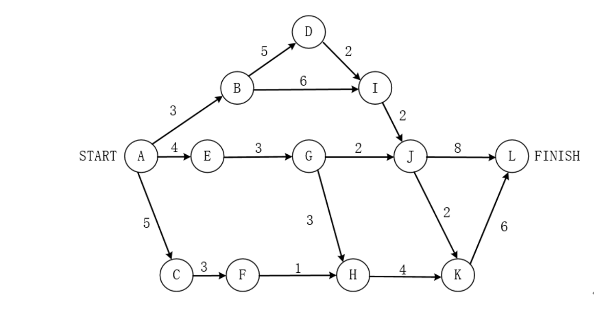

- 要求BI和EG的松弛时间，BI活动通过的路径有两条ABIJKL和ABIJL，其中两条路径的长度都为19，（如果有两条不同的路径应该选择最大的一条），用关键路径减去该路径的长度20-19=1，表示该活动的松弛时间。

- 松弛时间： 通过XX中的最大路径（有多条通过路径选择最大）， 用关键路径（最长路径）减去此路径得到松弛时间

- 语义分析阶段主要是分析各语法结构的含义，检查源程序是否包含静态语义错误，并收集类型信息提供后面的代码生成阶段使用。

- 在确认源程序的语法和语义后，可以对其进行翻译并给出源程序的内部表示。

  对于声明语句，需要记录所遇到的符号的信息，所以应该进行**符号表**的填查工作

  **符号表：** 用来记录源程序中各个符号的必要信息，以辅助语义的正确性检查和代码生成。

  **决策表**：是用于测试的

  **广义表：**是针对数据结构的表示

  **索引表：**是数据库中指示逻辑和物理记录对应的关系

  ## 第23题

  未看前个人理解：

  23、在单处理机计算机系统中有1台打印机、1台扫描仪，系统采用先来先服务调度算法。假设系统中有进程P1、P2、P3、P4,其中P1为运行状态，P2为就绪状态，P3等待打印机，P4等待扫描仪。此时，若P1释放了扫描仪，则进程P1、P2、P3、P4的状态分别为( )。

 

​	单处理机表示一次 只能运行一个进程

​	p1释放扫描机，打印机和扫描仪同步运行， 未说释放打印机， 故p1为运行态

​	p2由于p1打印运行中，故p2仍然为就绪态（待运行态），  p3仍为等待态(次运行态)

​	p4等待扫描仪，由于p1释放扫描仪后，资源释放， 获取资源后成为 就绪态（唯一 一个等待扫描仪）

- 除第一个磁盘R1不需要移动磁头位置，其余9个磁盘都需要移动8个磁盘，即总时间为R1的时间（1+2）ms，后面9个磁盘的时间9*（8+1+2），共计102ms

- 敏捷统一过程（AUP）采用“在大型上连续”以及在“小型上迭代”的原理来构建软件系统。

  采用经典的UP阶段性活动（**初始、精化、构建和转换**），提供了一系列活动，能够使团队为软件项目构想出一个全面的过程流。在每个活动里，一个团队迭代了使用敏捷，并将有意义的软件增量尽可能快地交付给最终用户。

  在每一个不同地系统都需要一套**不同地策略、约定和方法论**是属于敏捷方法-----水晶法的描述。

- 可移植性包括**：适应性、易安装性、一致性、易替换性**。

- **软件开发过程中：**

- V模型是测试贯穿于始终。

  其中  **系统测试和验收测试**是针对于**需求分析**

  **集成测试**针对于**概要设计**

  **单元测试**针对于**详细设计**

  **软件实现**应该是针对于**编码部分**。

- 软件维护的可维护性应该包括：**可理解性，可测试性，可修改性**。

- 考查关于面向对象的开发阶段。

  面向对象**分析阶段**：认定对象，组织对象，对象间的相互作用，基于对象的操作。

  面向对象**设计阶段**：识别类及对象、定义属性、定义服务、识别关系、识别包。

  面向对象**程序设计：**程序设计范型、选择一种OOPL。

  面向对象**测试：**算法层、类层、模板层、系统层。

-  考查关于面向对象设计的几大原则。

  **接口分离原则**：使用多个专门的接口要比使用单一的总接口要好。

  **开放-封闭原则：**对扩展开放，对修改关闭。

  **共同封闭原则**：包中的所有类对于同一性质的变化应该是共同封闭的。一个变化若对一个包产生影响，则将对该包里的所有类产生影响，而对于其他的包不造成任何影响。

  **共同重用原则**：一个包里的所有类应该是共同重用的。如果重用了包里的一个类，那么就要重用包中的所有类。

- A、需要使用一个算法的不同变体

  B、有一个语言需要解释执行，并且可将句子表示为一个抽象语法树

  C、一个对象的行为决定于其状态且必须在运行时刻根据状态改变行为

  D、一组对象以定义良好但是复杂的方式进行通信，产生的相互依赖关系结构混乱且难以理解。

A选项是对策略模式的描述，B选项是对解释器的描述，C选项是对状态模式的描述。

设计某购物中心的收银软件系统时，要求能够支持在不同时期推出打折、返利、满减等不同促销活动，收银软件系统的计入规则有：打折、返利、满减三种不同的策略，每种策略之间封装起来，可以相互替换，使它们可以独立的变换，属于**典型的策略模式。**

Matplotlib 是一个 Python 的 2D绘图库，它以各种硬拷贝格式和跨平台的交互式环境生成出版质量级别的图形，**不支持深度学习**

对于三级模式，分为外模式，模式和内模式。

-  其中外模式对应**视图级别**，是**用户与数据库系统的接口**，是用户用到那部分数据的描述，比如说：用户视图；

  对于模式而言，又叫**概念模式**，对于表级，是数据库中全部数据的**逻辑结构和特质的描述**，由若干个概念记录类型组成，只**涉及类型的描述，不涉及具体的值**；

  而对于内模式而言，又叫**存储模式**，对应文件级，是数据物理结构和存储方式的描述，是数据在数据库内部表示的表示方法，定义所**有内部的记录类型，索引和文件的组织方式**，以及数据控制方面的细节。例如：**B树结构存储，Hash方法存储，聚簇索引**等等。

- **索引** 是数据库中**提高查询效率的一种机制**，不能进行数据更新。 
- **视图**  一般是提供查询数据的，具有**一定安全机制**，但是**不能进行数据更新**。
- **触发器**  可以作为更新机制，但是无法避免**数据库的关系模式被第三方所获取**，并不安全。
- **存储过程方式**，可以定义一段代码，从而提供给用户程序来调用**，具体更新过程通过代码调用，避免了向第三方提供系统表结构的过程，**体现了数据库的安全机制。所以本题选择B选项。

- 等比数列**求和公式： a1(1-q^n)/(1-q)**

- 二叉树层数：

- 1024而言 , 2^10 =1024，所以我们不能取到11层，应该先到第10层 2^9= 512，此时10层共累计的节点有：2^ 0+ 2^1+...+ 2^9=1023，共有1024还缺少1个结点，只能存放到第11层，第11层仅有1个结点，但是它的层次已经到了11层，所以能取到11，属于闭区间，排除B选项，故表达式取值范围应该是[11, 1024]。

- ARP协议：地址解析协议，作用是由IP地址转换成MAC地址 

  RARP协议：反地址解析协议，作用是MAC地址转换成IP地址 

  对于ARP而言，请求是广播发送，ARP响应是单播发送。 

  故有**ARP Request采用广播进行传送，ARP Response采用单播进行传送**

- 路由协议：是一种**指定数据包转送方式**的网上协议。

- Internet网络的主要节点设备是**路由器**，路由器通过**路由表**来转发接收到的数据。

- （1）A、focus 关注点 B、process 过程 C、goal 目标 D、function作用

  （2）A、developing发展中的 B、deploying 使展开，部署 C、training 训练、培养 D、operational 操作的

  （3）A、developed 先进的，发达的 B、functional 功能的 C、constructed 构件 D、secure 保护

  （4）A、 single 单一的 B、 whole 完整的，全部的 C、continuous 连续的 D、independent 自主的，不相干的

  （5）A、develop 发展 B、integrate 整合 C、analyse 分析 D、maintain 维持

- 一个栈的栈顶元素为在：栈顶指针 指向栈顶元素下一位（待插入位置）， 故一个开口向上栈 A[i]和开口向下的栈B[j] 共用同一个栈时， i - j ==1， 栈内存满， 满时指针指向位置为彼此最后一个元素的位置

### 第6题

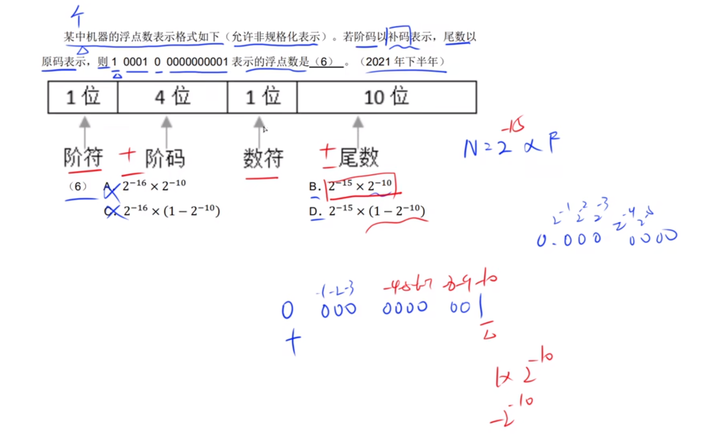

此题解法： N（浮点数） = 2^e * F   , e表示阶码的原码， F为尾数的整数表示

​		所以此题为： 阶码原码 = 阶码复原，据题干阶符为负数， 所以阶码要取反＋1 再加符号位

此题答案为： 2^-15  * 2^-10 (尾数)

阶码的取值范围决定了浮点数能表示的数的范围，而尾数的位数决定了浮点数的精度和表示能力

阶码越大取值范围越大，  尾数位数越多则越精细

### 第27-28题

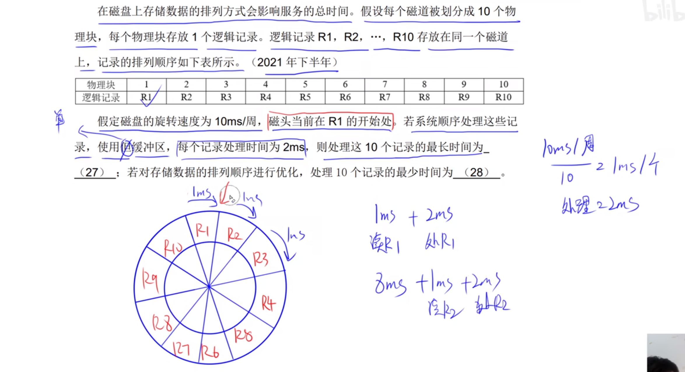

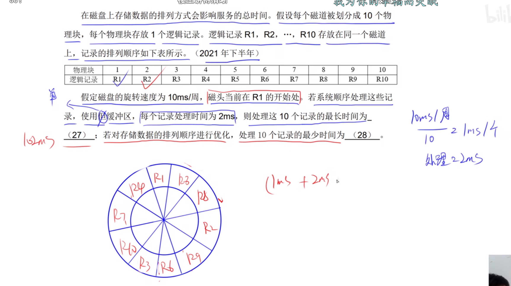

此题解题思路： 

先算出读取每个物理块的时间， 周期/ 个数 = 1s

得知此题： 读取每个磁块为1s， 处理为2s,  当读取第一个物理块时，由于在R1开始处所以不需要转动，读取之后处理2s（跨越两个物理块R2， R3），跳到物理块4的开始处，需要旋转一周到R2（跨越8个物理块，所以为 8 +1 +2   ） 所以最长时间为： R1 + 9个物理块读取处理后的时间： 3 + （8+2+1）*9 = 102ns

​	最短为： 读取处理第一个物理块后，跨越两个后直接到达目标物理块Rx+1, 所以 3 *10 = 30 ns

### 第34-35

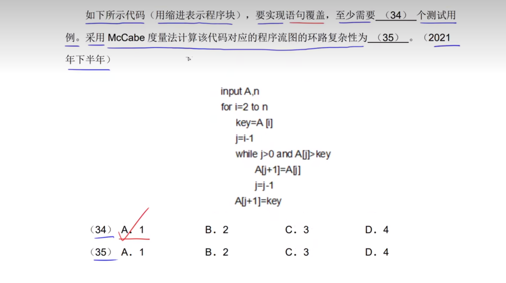

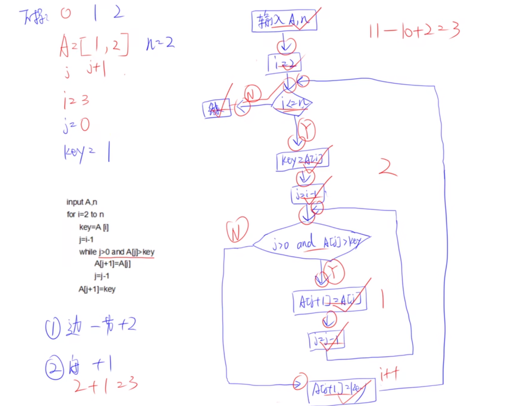

测试用例： 用多少个例子就能将所有语句执行完， 此题需画流程图

环路复杂性： 边（箭头） - 节点数 +2       /      闭合（循环数） + 1

### 39-40题

身体器官- 组合， 汽车引擎 - 聚合 （整体和部分关系） 

可脱离为聚合（可单独存在 ）

不可脱离为组合（共同存在，共同消失）

### 41-43

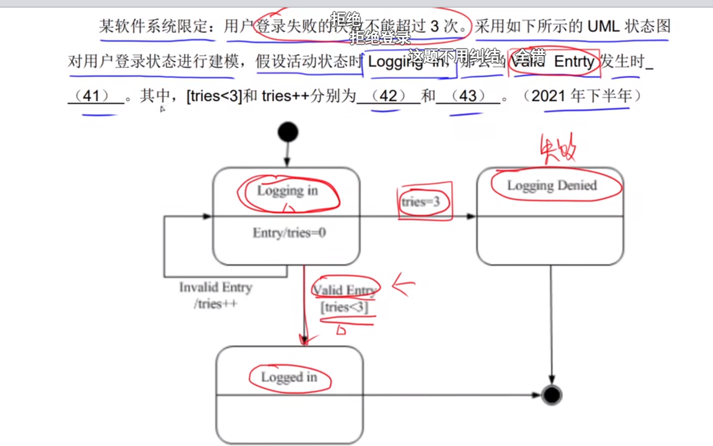

此题解法： 当某个事件发生时，仅需判断此事件 判断的条件（监护条件）

Entry/tries ， 此监护条件判断是否tires小于3， 所以选择

tires ++ 此类具体的操作， 称为转换

### 44~45 （设计模式分类）

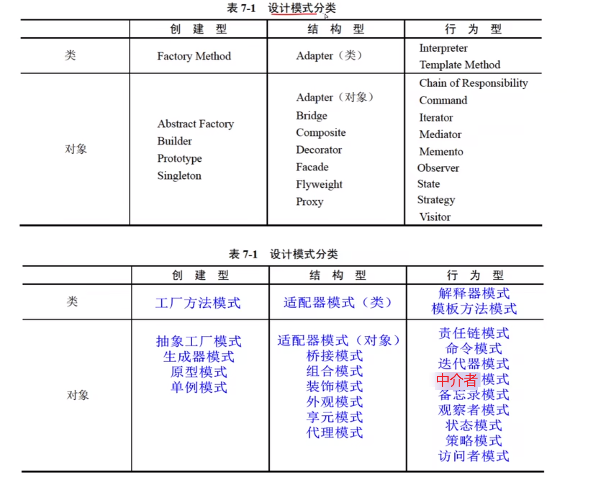

### 49

python ： 列表（List） 可变的 有序 序列结构， 元素可重复

​						元组（tuple） 类同list， 但是不可变， 为只读

​			集合（set)  为 可变的 无序， 元素不可重复

​			字符串（str） 元素	不可变，不可修改

​		

### 61

有向图G 进行拓扑后得到拓扑序列 ： Vi 在 Vj前，说明G 中 一定不存在有向弧（Vj, Vi）

​		可能存在有向弧<vi vj>,  不一定存在从vi -vj路径， 一定不存在 Vj到v的路径

​		有向无闭环， 只能从顶点（位置较前）到 顶点之后的点

## 64-65 Huffman 编码

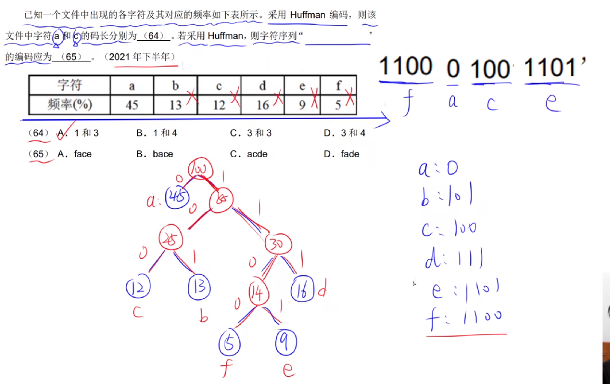

解题： 根据字符频率构建哈夫曼树， 左小右大， 从下到上依次构建，每次找数字最小的两位生成上个节点，再将新的节点放入后重新比较，找到最小两位重新生成节点，直至字符使用完毕，     生成根节点

​			 左0右1， 码长为数长

## 下午题

### 第三题

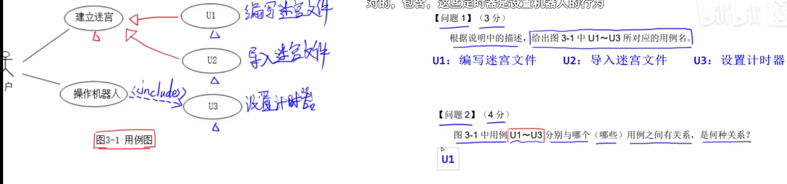

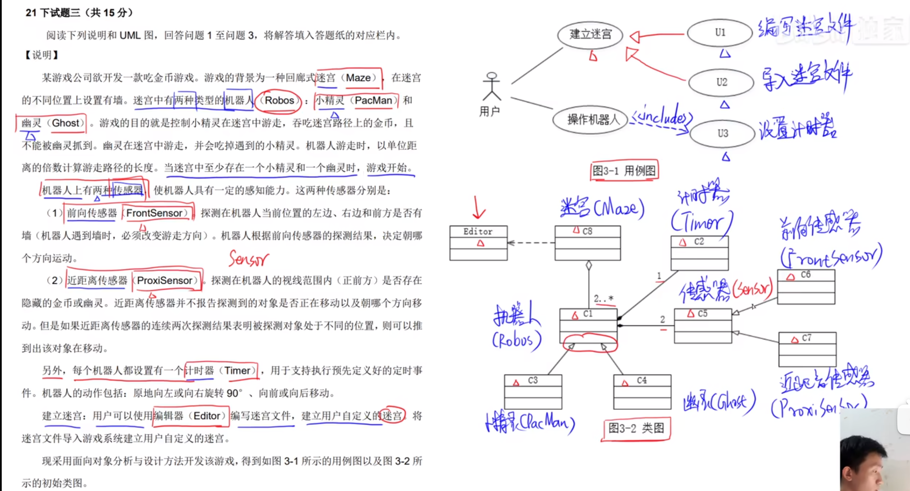

包含： 指执行某操作必须执行的用例

泛化为 抽象具体化， 具体化指向抽象，子类指向父类 ， 箭头（空心白色三角形）

