# 5.15- 5.16 word 105 页重温

数据流图博客

https://blog.csdn.net/qq_52108058/article/details/130657109

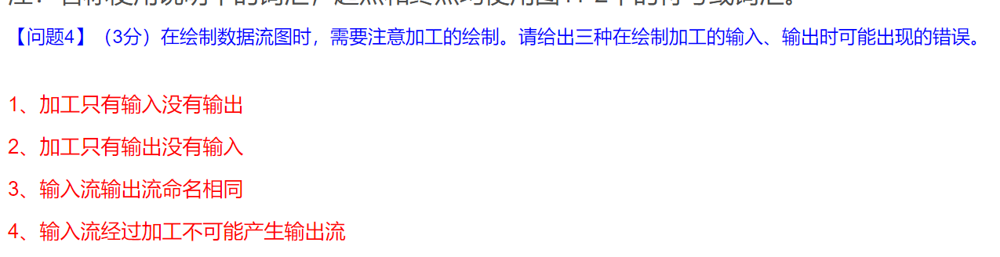

# 5.17  

# 计算机组成与结构

## 流水线最大吞吐率

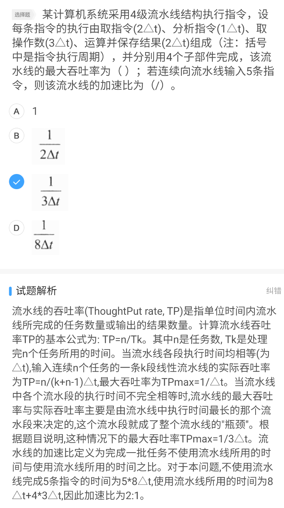

> 最大吞吐率为： 流水线任务时长最长的时间 的 倒数， 如题为3Δt
>
> 加速比：  不使用流水线 /  使用流水线

流水线**时长** = 第一条运行的时间 + 最长 × （指令数-1）

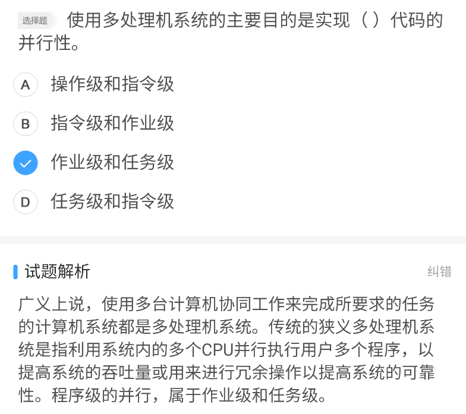

## 主存地址定位到Cache的方式

 				为解决高速CPU与低速内存之间的速度差异，最经济、有效的方法是在两者之间插入容量不大但操作速度很高的存储器髙速缓存（Cache），起到缓冲作用

使CPU既可以以较快速度存取Cache中的数据，又不使系统成本过高。

 与主存相比，Cache的容量很小，它保存的只是一部分主存内容的一个副本，且Cache与主存的数据交换是以块为单位。 地址映射即是应用某种方法把主存地址定位到Cache中，有全相联方式、直接方式和组相联方式三种方式。 

1.全相联映射方式。 这是一种最简单而又直接的映射方法，指主存中每个块只能映射到Cache的一个特定的块。在该方法中，Cache块地址j和主存块地址i的关系为： j=i mod Cb 其中Cb是Cache的块数。这样，整个Cache地址与主存地址的低位部分完全相同。

直接映射法的优点是所需硬件简单，只需要容量较小的按地址访问的区号标志表存储器和少量比较电路；缺点是Cache块冲突概率较高，只要有两个或两个以上经常使用的块恰好被映射到Cache中的同一个块位置时，就会使Cache命中率急剧下降。

 2.直接映射方式。 这种映射方式允许主存的每一块信息可以存到Cache的任何一个块空间，也允许从已被占满的Cache中替换掉任何一块信息。全相联映射的优点是块冲突概率低：其缺点是访问速度慢，并且成本太高。

 3.组相联映射方式。 这种方式是前两种方式的折衷方案。这种映射方式在组间是直接映射，而组内是全相联映射，其性能和复杂性介于直接映射和全相联映射之间。

 CPU在访问内存时，首先判断所要访问的内容是否在Cache中，如果在，就称为“命中”，此时CPU直接从Cache中调用该内容；否则，就称为“不命中”。一般来说，Cache的存储容量比主存的容量小得多，但不能太小，太小会使命中率太低；也没有必要过大，过大不仅会增加成本，而且当容量超过一定值后，命中率随容量的增加将不会有明显地增长。             

 				RISC和CISC是目前设计制造微处理器的两种典型技术，虽然它们都试图在体系结构、操作运行、软件硬件、编译时间和运行时间等诸多因素中做出某种平衡，以求达到高效的目的，但采用的方法不同，主要区别有：

 ①指令系统：RISC设计者把主要精力放在那些经常使用的指令上，尽量使它们具有简单高效的特色。对不常用的功能，常通过组合指令来完成。因此，在RISC机器上实现特殊功能时，效率可能较低。但可以利用流水技术和超标量技术加以改进和弥补。 而CISC计算机的指令系统比较丰富，有专用指令来完成特定的功能。因此，处理特殊任务效率较高。 

②存储器操作：RISC对存储器操作有限制，使控制简单化；而CISC机器的存储器操作指令多，操作直接。 

③程序：RISC汇编语言程序一般需要较大的内存空间，实现特殊功能时程序复杂， 不易设计；而CISC汇编语言程序编程相对简单，科学计算及复杂操作的程序设计相对容易，效率较高。

 ④中断：RISC机器在一条指令执行的适当地方可以响应中断；而CISC机器是在一条指令执行结束后响应中断。 

⑤CPU: RISC的CPU包含有较少的单元电路，因而面积小、功耗低；而CISC CPU包含有丰富的电路单元，因而功能强、面积大、功耗大。

 ⑥设计周期：RISC微处理器结构简单，布局紧凑，设计周期短，且易于采用最新技术；CISC微处理器结构复杂，设计周期长 

⑦用户使用：RISC微处理器结构简单，指令规整，性能容易把握，易学易用；CISC微处理器结构复杂，功能强大，实现特殊功能容易。

 ⑧应用范围：由于RISC指令系统的确定与特定的应用领域有关，故RISC机器更 适合于专用机；而CISC机器则更适合于通用机。   

 

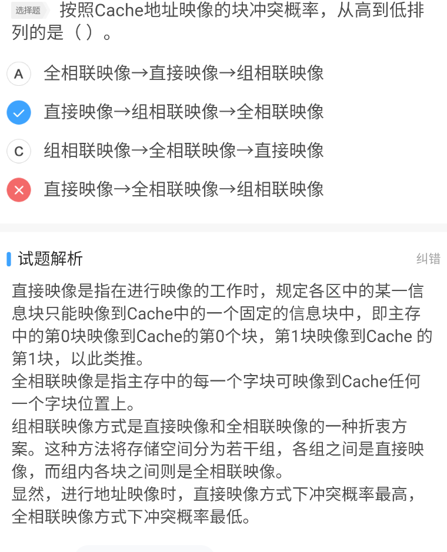

## 输入输出控制方式

 				在计算机中，输入输出控制方式主要有5种，分别是程序查询方式(程序控制方式)、程序中断方式、DMA工作方式、通道方式、I/O处理机。这5种方式占用主机CPU时间按多到少排序为:程序查询方式(程序控制方式)、程序中断方式、DMA工作方式、通道方式、I/O处理机。             

## 浮点表示法

 				在浮点表示方式下，浮点数的精度由尾数部分来确定，范围则取决于阶码的长度，因此阶码e越大，所表示的浮点数值范围越大，尾数的位数m越大，所表示的浮点数精度越高。          

### 不懂

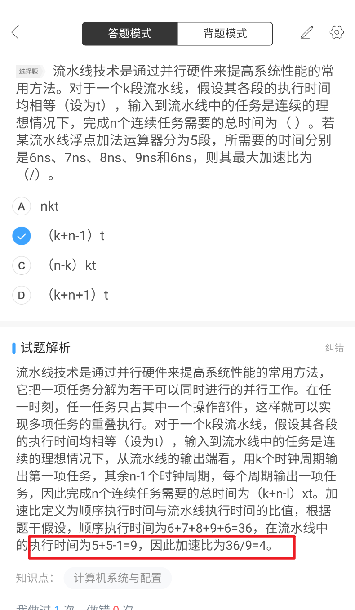

   

#  5.18

# 操作系统选择题

 				

## 管道通信

 		管道通信是一种共享文件模式，它基于文件系统，连接于两个通信进程之间，以先进先出的方式实现消息的单向传送。管道是一个特殊文件，在内核中通过文件描述符表示。一个管道总是连接两个命令，将左边命令的标准输出与右边命令的标准输入相连，于是左边命令的输出结果就直接成了右边命令的输入

## 段表判断是否越界

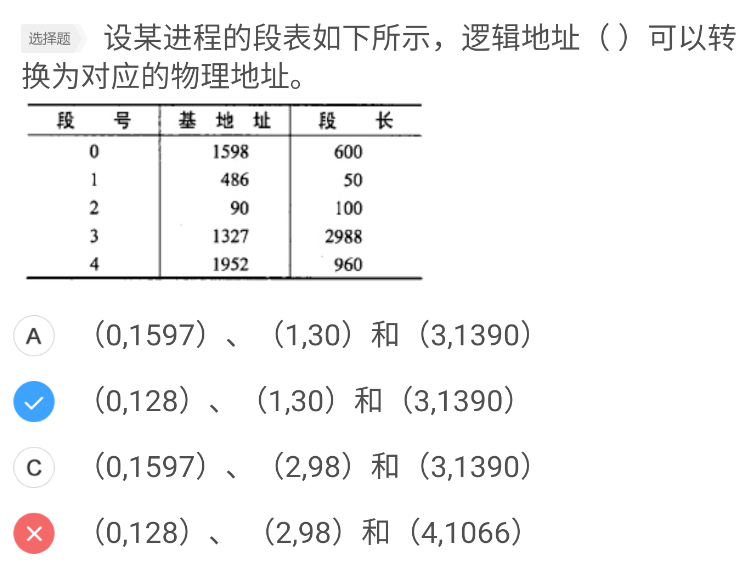

 逻辑地址： （0，128）表示 在基地址的基础上加上偏移量，判断是否大于段长

​	段号0， 基地址为1598，段长600

- 段的起始地址：1598
- 段的结束地址：1598 + 600 - 1 = 2197

（0，128）， 只需判断128 是否小于段长，是的话不越界，能找到

## 磁盘数据块索引

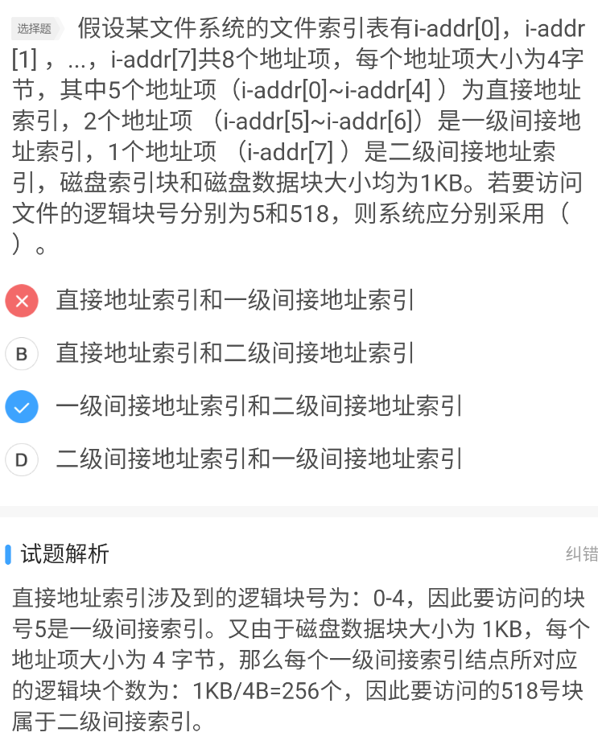

逻辑块号： 直接索引 为 1对1

索引的块号个数为： 1KB / 4B = 256 

一级地址直接索引 

-   arr[5] = 5~ 260

-  arr[6] =  261 ~ 516 

所以 518在二级间接地址索引

一级可索引的块大小为： 512  * 1K  *2个 = 1024K

## 微内核结构的操作系统设计功能图

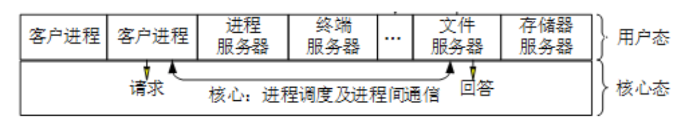

## 磁盘调度  移臂调度与旋转调度

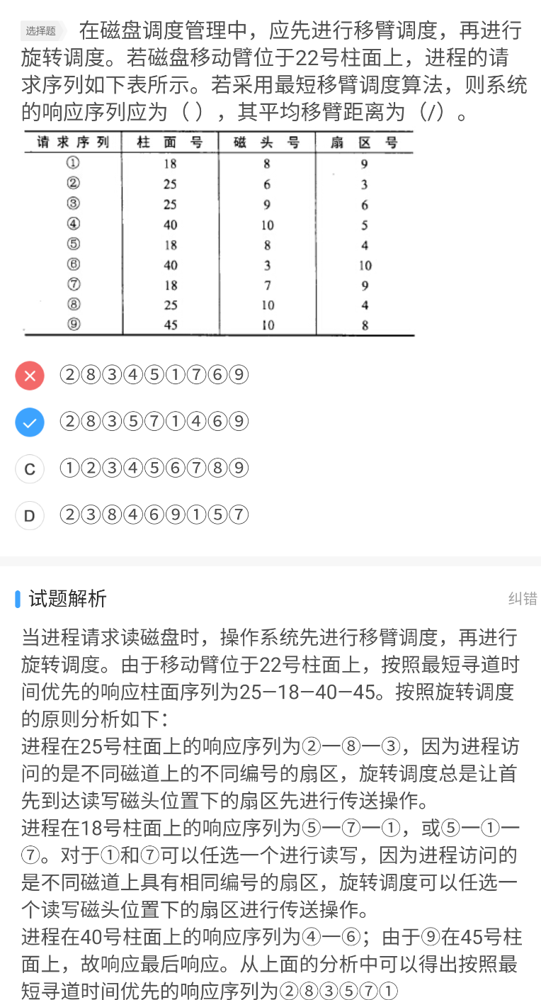

   解题思路， 与22比较，后与前者比较， 距离最短依次排序， 22 - 25 - 18-40-45

​		然后同柱，先扇区后磁头号，即可得出答案

## 链式存储找磁盘块

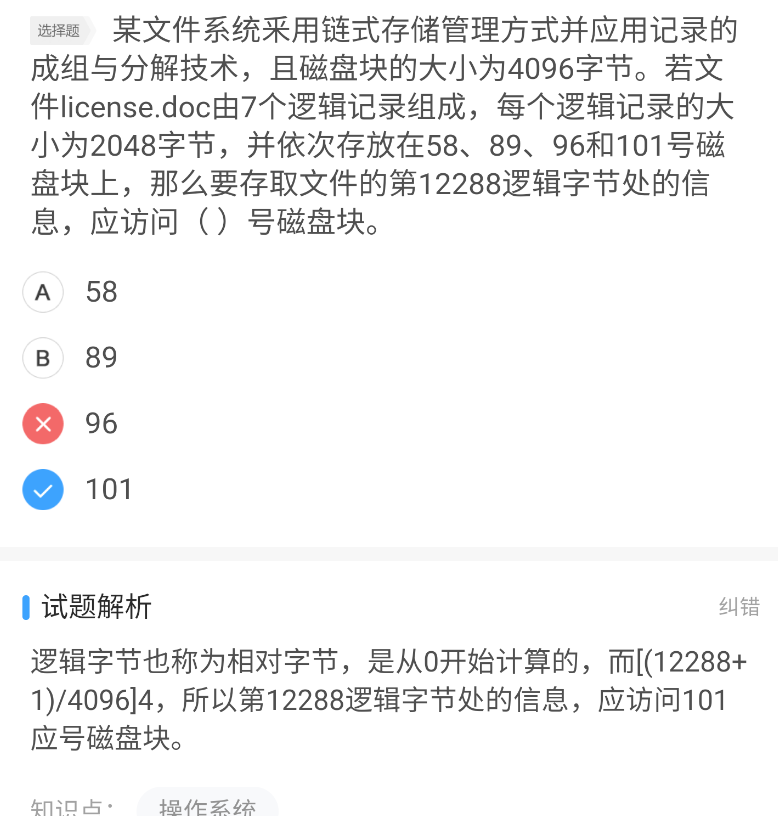

位示图大小与物理块的关系

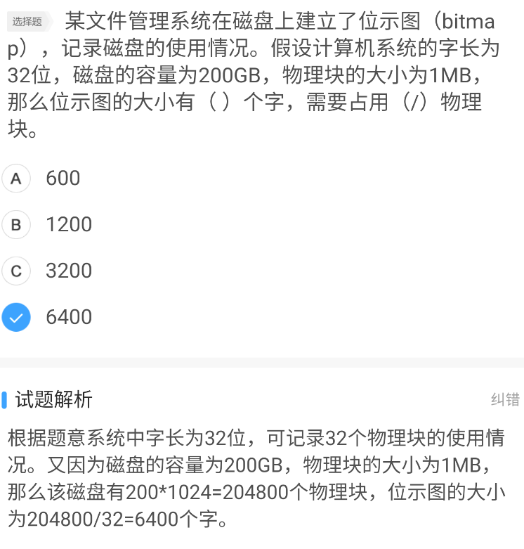

# 改变策略  - 直接刷真题

## 2022下半年真题

## 选择题

2- cpu 主要由运算器、 控制器、 寄存器组和**内部总线**（数据总线DBUS、 地址总线 ABUS ）等部件组成

- Dram 动态随机存储器， 需要不断**刷新**电路，否则数据消失

- 浮点数的**阶码决定范围，尾数决定精度**

- x.509 密码算法为： rsa , sm2算法为 ecc
-  软件著作权的翻译权： 将原软件由一种**自然语言文字**转换成另一种自然语言文字
- 原型开发适用于**需求不明确**的系统，整个过程在探索，开发成本高
- c/s三层结构描述中：应用的各层可以**并行开发，不一定**需要相同的开发语言
  - MVC 结构，前端用HTML语言，控制层和模型层用Java语言

- 多个模块**共享**同一个公共的数据环境，同享多个变量则是公共耦合
- 语句覆盖是**最弱**的路径覆盖，包含的情况少，**发现错误的能力弱**
- 软件文档使用者不同分成不同类型，所以由不同标准和要素
- 组件=模块，**单个模块**测试我们使用单元测试
- 对**数据**进行增删查改为数据维护
- 修改某个类的原因只有一个，即一个类只做一种类型的功能，该原则叫做**单一责任**
- 构件图表示系统部署，实现时各个构建之间的关系，为**系统的静态实现图**
- t38使多个前后连接的对象都有机会请求为： **责任链模式**，属于**行为型对象**模式，该模式适用于可处理一个请求的对象集合应被动态指定
  - 
- 客户端接口统一的驱动方法，适合采用： **适配器模式**
-  python中处理异常使用： **try except..**
- PYTHON3中，list(range(11) [10:0:-2]) : range（11）产生0-10，11个数字，后者表示从下标为10遍历到下标为0的后一个元素数据， **前闭后开[ 10:0）** [10,8,6,4,2]
- - x=input(),从键盘输入123， 打印的为**字符串**‘123’

- **多对多**的两个实体构造的中间表关键字由两张表的关键字组合而成
- 事务程序中发生的错误，叫做**事务**故障
- 采用邻接矩阵存储点与点的关系，有N个点，就有N*N元素，有e条边，有e个元素为1
- m阶B-树的说法中，错误的为： 叶子结点通过指针链接为有序表， 叶子结点本身依关键字的大小自小而大顺序链接
- 归并排序需要n 空间， 快速排序需要**lgn**个空间， 堆排序需要**1**个空间，冒泡排序需要**1**个空间， 所以**归并排序占用辅助存储空间最多
- 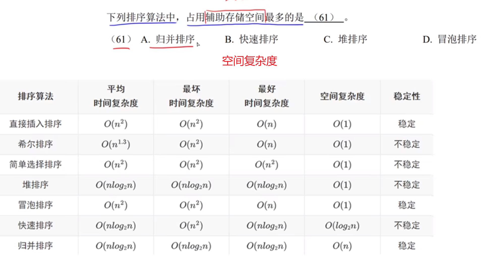
-  p52 折半查找是典型的分治法
- Dijkstra 最短路径为**贪心思想**实现， 最短路径依图直接得出
- VLAN **tag 技术用于交换机**， 属于OSI 参考模型的 数据链路层
- Telnet协议是一种 基于 TCP的 远程登录协议， 对于通信质量要求较高使用TCP，确保高质量的通讯
- HTTP和HTTPS
- - https 协议使用加密传输，默认服务端口号为443
  - http 协议默认服务端口号为80
  - https的s表示**safe**安全， 电子支付类的网站使用**https 安全性高**

- 将网址转化为IP地址要用 **域名解析** 协议 （把文本标识的网址转化为数字标识网址）
  -  IP地址由服务器分配， 不具备唯一性， mac地址具唯一性，每一个硬件的身份证

1. ip地址长度为32 / 48为，mac地址为48位
2. ip地址工作网络层， mac地址工作在数据链路层
3. ip地址的分配是基于网络拓补（服务器分配，网络拓展）， mac地址基于制造商

- c59 英语选项： 
  1. style 结构、风格 
  2. functions 功能
  3. regarded视为
  4. statelessness无状态 

### 第24题前驱图 快速解法

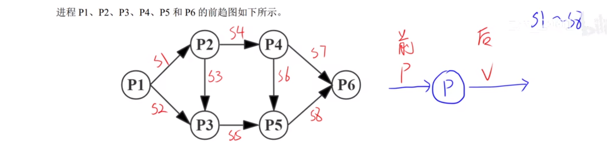

如图，信号量 = 边数， 信号量的顺序，按照箭头指向后p数字组合的大小进行排序，如p1-p2 = 12 为最小， p5-p5 = 56最大为 s8

- p执行前为 p ，执行后为 v
- 如图 p3 执行前为： P (s2) P(s3),  中执行后为 V s(5)

### 44-46 责任链

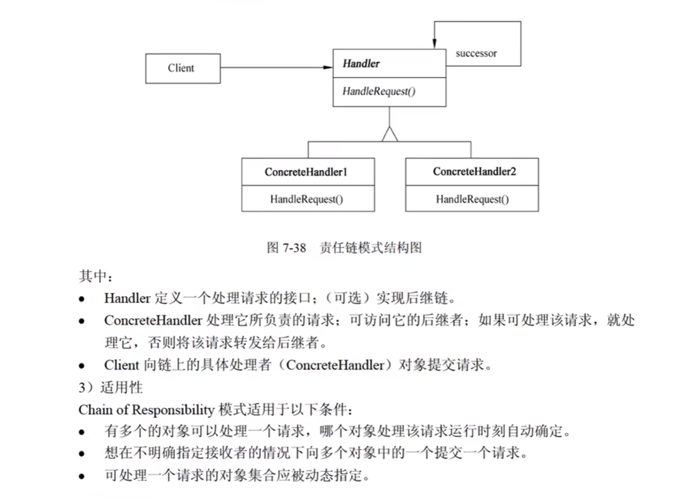

- 责任链模式： 可处理一个请求的对象应被动态指定
- 过滤器模式： 不同的标准过滤一组对象，并通过逻辑操作以解耦的方式将它们进行链接起来
- 备忘录模式： 必须保存一个对象在某一时刻的状态，需要它时才能恢复到先前的状态
- 策略模式: 一个类定义了多种行为，并且以多个条件语句的形式出现

### 52- 53  主键及函数依赖集

 主键： 可以为**复合主键**，前提是多个子主键都无法独立推出所有属性

插入异常： 本该插入的数据，插入失败

删除异常：不应该删除的数据被删除

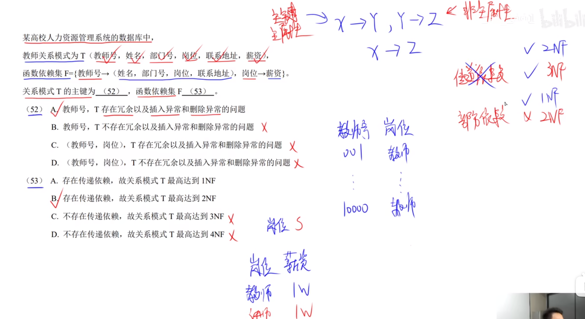

**存在冗余**， 在本题中， 为岗位和薪水可提取出来放在一张表，只写一行即可，如 岗位： 教师， 薪水1w， 就不用在原先表中重复输出数据

**插入异常**： 为插入一个新岗位： 讲师，由于主键为空（暂时没有教师）故插入失败

**删除异常**：删除了一行 岗位只有一个在职的讲师信息， 将讲师这项本应该存在的岗位删除

**解决措施**： 同存在冗余， 只需岗位薪水表中添加新职位， 即使原先数据删除也无影响

**传递依赖**：通过教师号 -》 岗位号-》 薪水，能通过属性 再间接获取另外一个属性， 故存在传递依赖， 传递依赖不为第三范式，最高可达第二范式

**部分传递依赖**：不达第二范式， 最高可达第一范式

### 54-55 关系代数式

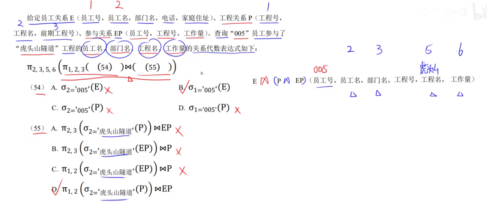

- 第一小题，需先观察005为哪张表所特有的属性，员工号对应的为E表， 且员工号为第一列故选B

- 第二小题， 虎头山隧道为工程名在p表中， 自然联结需要有共同属性， EP 连接 P表仅1-工程号满足，故选D

Π x1, x2 表示只保留 1 和 2 列

在此题中： 将E表与 （ 工程关系表(只保留1-2列 ) 同 参与关系表 联接 ->  去掉下一张表的共同属性后 合并表 ）

Π123 E表 保留前三列的E表  = E（员工号， 员工名， 部门名）

p 🔗EP （工程号， 工程名， 员工号， 工作量） 

再将上者两张表🔗： （员工号， 员工名，部门名， 工程号，工程名，工作量）

Π 2356  = （员工名， 部门名， 工程名， 工作量）

[此题连接](https://www.bilibili.com/video/BV1Fv4y1S7rU?p=45&spm_id_from=pageDriver&vd_source=c0725c5cec93fb4b8f40b1ca1664d64c)

### 60  m阶B-树的说法

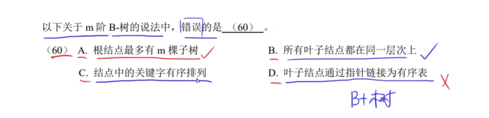

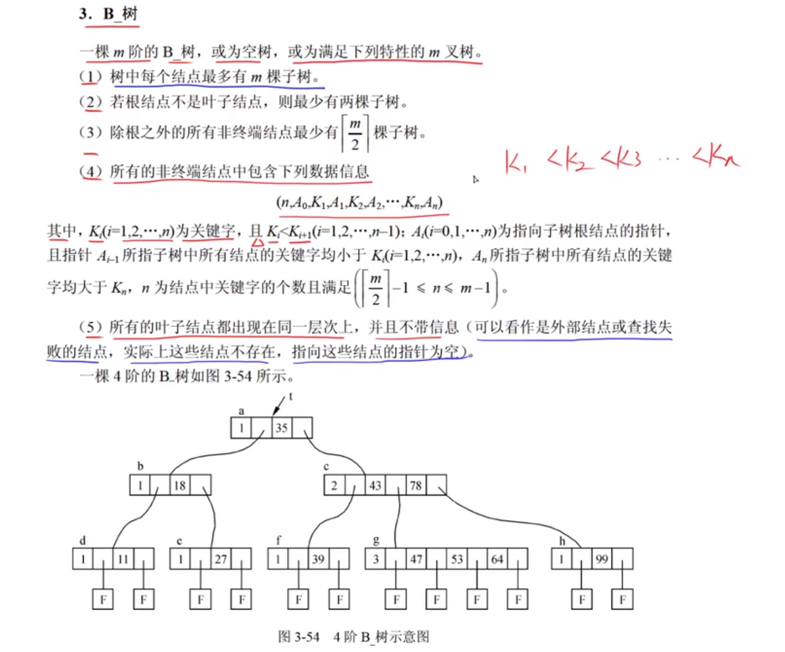

### 62-63 分治算法 （未看）

[此题链接](https://www.bilibili.com/video/BV1Fv4y1S7rU?p=52&spm_id_from=pageDriver&vd_source=c0725c5cec93fb4b8f40b1ca1664d64c)

  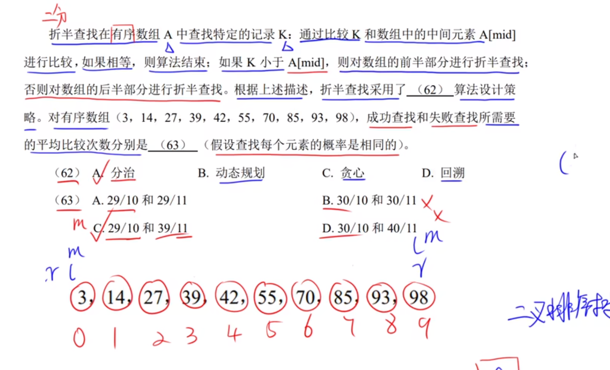

二叉树排序树表示， 再加上层数

​	有多少个叶子节点进行 **相加**

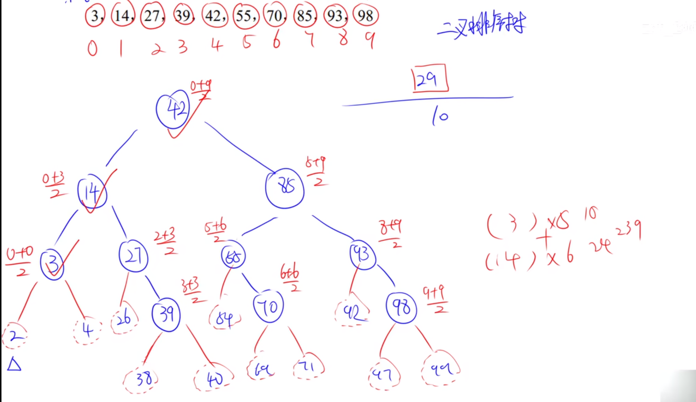

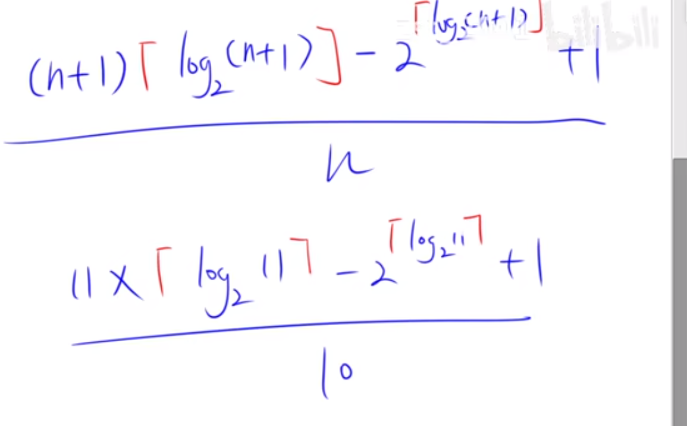

## 下午题  (5.20)

数据流图：

通过拿顶层数据图与0层数据图**进行比对**： 找到确实的数据流

0层数据流图 缺失的数据流：

1、 与顶层比对信息一 一比对， 再将缺失的信息进行比对

2、  一个实体应该有出 入 ，入 -> 某个实体 ->  出， 如果发现某段缺失，则该位置缺少数据流方向，再通过原文将缺失的数据流图补充

 

**数据流的意义**： 即通过比对原本直接抄写 即可

**表格**：为进行操作的信息 + 表字   如：计量检测信息 则为从 **计量检测信息表** 获取 

## 第二道－　ER图

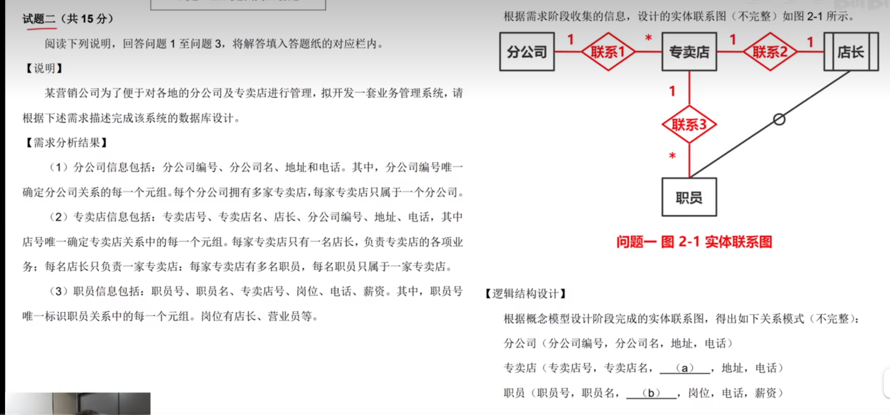

实体间的联系：　１对１　，　１对多，　多对多

​	**在逻辑结构中：**

- １对多的情况下，　需要将１的主键写入多中，　作为其外键（联系）
- １对１的情况下：　将一方的主键写入任意一方的属性中
- 多对多不写入，使用一个关联表（重新建立一张表）来表示该关系。在关联表中，通常会包含两个实体的主键作为外键，以建立实体之间的关系

主键：通过该键可获取该实体其它属性的信息

外键：通过该键可与另外一个实体建立联系，　是另外一个实体的主键

